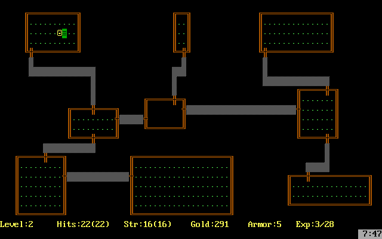

# Project Team 01 — Java_Bootcamp

Summary: In this team project, you will develop a console-based "roguelike" game application in Java using the JCurses library (in the Java version) inspired by the classic 1980 game Rogue.

💡 [Click here](https://new.oprosso.net/p/4cb31ec3f47a4596bc758ea1861fb624) to share your feedback on this project. It’s anonymous and will help our team improve the course. We recommend filling out the survey right after completing the project.

## Contents 

  - [Chapter I](#chapter-i)
    - [Instructions](#instructions)
  - [Chapter II](#chapter-ii)
  - [Overview](#overview)
    - [Rogue 1980](#rogue-1980)
    - [Application Architecture](#application-architecture)
  - [Chapter III](#chapter-iii)
  - [Task 0. How Did We Get Here?](#task-0-how-did-we-get-here)
  - [Task 1. Core Entities of the Game](#task-1-core-entities-of-the-game)
  - [Task 2. Upbeat Gameplay](#task-2-upbeat-gameplay)
    - [Game logic](#game-logic)
    - [Character Logic](#character-logic)
    - [Enemy Logic](#enemy-logic)
    - [Environment Logic](#environment-logic)
    - [Combat Logic](#combat-logic)
  - [Task 3. The Generated World](#task-3-the-generated-world)
  - [Task 4. Cozy 2D](#task-4-cozy-2d)
    - [Rendering](#rendering)
    - [Controls](#controls)
    - [Statistics](#statistics)
  - [Task 5. Cartridge with a Battery](#task-5-cartridge-with-a-battery)
  - [Task 6. Additional Task: You Shall Not Pass!](#task-6-additional-task-you-shall-not-pass)
  - [Task 7. Additional Task: The Art of Balance](#task-7-additional-task-the-art-of-balance)
  - [Task 8. Additional Task: Imagine You’re a Table](#task-8-additional-task-imagine-youre-a-table)
  - [Task 9. Additional Task: Full 3D](#task-9-additional-task-full-3d)

## Chapter I

### Instructions

1. Throughout the course, you will experience uncertainty and a severe lack of information — this is normal. Remember that the repository and Google are always available to you, as are your peers and Rocket.Chat. Communicate. Search. Rely on common sense. Do not be afraid of making mistakes.
2. Pay attention to sources of information. Verify, think, analyze, compare.
3. Read the assignments carefully. Reread them several times.
4. It’s best to read the examples carefully as well. They may contain something not explicitly stated in the assignment itself.
5. You might encounter inconsistencies when something new in the task or example contradicts what you already know. If that happens, try to figure it out. If you fail, make a note under “open questions” and resolve it during your work. Do not leave open questions unresolved.
6. If a task seems unclear or unachievable, it only seems that way. Try decomposing it. Most likely, individual parts will become clearer.
7. Along the way, you’ll encounter many different tasks. Those marked with an asterisk (\*) are for more meticulous learners. They are of higher complexity and are not mandatory, but if you do them, you’ll gain additional experience and knowledge.
8. Do not try to fool the system or those around you. You’ll only be fooling yourself.
9. Have a question? Ask the neighbor on your right. If that doesn’t help, ask the neighbor on your left.
10. When using someone’s help, always make sure you understand why, how, and what for. Otherwise, that help is meaningless.
11. Always push only to the **develop** branch! The **master** branch will be ignored. Work in the **src** directory.
12. Your directory should not contain any files other than those specified in the tasks.

## Chapter II 
## Overview 

### Rogue 1980

Rogue is a computer game developed by Epyx in 1980. Its main theme is dungeon exploration. The game was extremely popular on university Unix systems in the early 1980s, and spawned an entire genre known as "roguelike" (roguelike games, also called "roguelikes").

In Rogue, the player assumes the role of an adventurer, typical of early fantasy role-playing games. The game begins at the top level of an unexplored dungeon filled with monsters and treasures. As the player progresses through the randomly generated dungeon, the strength of the monsters increases and the difficulty of the dungeon increases.

Each dungeon level consists of a grid of 3x3 rooms or dead ends where a room might be expected. Later versions also included mazes and winding corridors. Unlike most adventure games of the time, the dungeon layout and object placement were randomly generated, making each playthrough unique and equally risky for newcomers and experienced players.

The player has three attributes: health, physical strength, and experience. All three can be increased with potions and scrolls, or decreased by stepping on traps or reading cursed scrolls. The wide variety of magic potions, scrolls, wands, weapons, armor, and food makes for a rich game experience and many ways to win or lose.

### Application Architecture

When developing applications with data, business logic, and user interfaces, a multi-layer architecture is typically used. The classical division can be represented as:

- Presentation Layer (View, UI);
- Business Logic Layer (Domain, Business Logic);
- Data Access Layer (Data Source).

By separating the business and presentation layers, it becomes easier to organize the application logic and to separate components with different reliability.

In the presentation layer, you should place the code that handles displaying the screen and receiving user input. This should reflect the interactions with the JCurses library components and the Domain layer.

The domain layer should reflect the business logic of the application that is not tied to frameworks. In the current project, this includes defining the logic of entities related to the game: the game itself, the player, enemies, levels, maps, and others, as well as the game process logic. The player's position and the logic for changing the player's position numerically on the map should be reflected in this layer and passed to the Presentation layer for rendering. Note that according to the concept of clean architecture, the business logic layer should not depend on other layers. To achieve this, the principle of dependency inversion should be used.

To facilitate interaction between layers, you can use patterns of MVC family (MVP, MVVM, MVPVM, etc.), where application logic layers (Model) are connected with presentation layers (View) by special "binding" layers (Controller, Presenter, View Model, etc.).

The Data layer in the application should handle the work with data. In this case, it will manage the storage of the game history.

## Chapter III

## Task 0. How Did We Get Here?

The game application:

- Must be implemented in Java version 21.
- Must have a console interface based on the JCurses library.
- Must be controlled via the keyboard.
- Must have a well-thought-out, clean architecture with clear layer separation.
- Must implement the logic of the classic Rogue 1980 game with a few simplifications (specific requirements for game mechanics are described in later sections).
- If any aspects of game mechanics are not covered in the text, it is permissible to refer to the original mechanics of 1980.

## Task 1. Core Entities of the Game

The game must support the layered architecture described in the Application Architecture section. The game must have defined layers: domain and gameplay, rendering, and data handling.

To start developing the game, implement the domain layer, which describes the primary game entities.

Recommended core entities with basic attributes (a necessary but not exhaustive list):

- Game session
- Level;
- Room;
- Corridor;
- Character:
  + Maximum health
  + Health,
  + Agility,
  + Strength;
- Backpack;
- Enemy:
  + Type,
  + Health,
  + Agility,
  + Strength,
  + Hostility;
- Item:
  + Type,
  + Subtype,
  + Health (restoration amount for food),
  + Maximum health (restoration amount in specific units for scrolls and elixirs),
  + Agility (restoration amount in specific units for scrolls and elixirs),
  + Strength (restoration amount in specific units for scrolls, elixirs, and weapons),
  + Value (for treasures).

## Task 2. Upbeat Gameplay

Implement the gameplay of the game in the **domain** layer, independent of the **presentation** and **data** layers.

### Game Logic 

- The game must consist of 21 dungeon levels.
- Each dungeon level must consist of 9 rooms connected by corridors.
- Each room can contain enemies and items.
- The player controls the movement of the character, can interact with items and fight enemies.
- The player's goal is to find the transition to the next level in each room, completing 21 levels.
- On each level, the player starts at a random position in the starting room, where enemies are guaranteed to be absent.
- After the main character dies, the game state is reset and everything returns to the beginning.
- With each new level, the number and complexity of enemies increases, the number of useful items decreases, and the amount of treasure increases.
- After each playthrough (whether successful or not), the player's score is recorded in a scoreboard, showing the dungeon level reached and the amount of treasure collected. The scoreboard should be sorted by the amount of treasure.
- The whole game should operate in a turn-based mode (every action of the player triggers actions of the enemies).

### Character Logic

- The character's health attribute should display the current level of health, and when the character's health reaches 0, the game should end.
- The maximum health attribute should indicate the highest level of health that the character can regain by consuming food.
- The Agility attribute should be used in the formula for calculating the probability of enemies hitting the character and vice versa, as well as affecting the speed of movement through the dungeon.
- The Strength attribute should determine the base damage the character deals without weapons, and should also be included in the damage calculation when using weapons.
- When an enemy is defeated, the character will receive an amount of treasure based on the difficulty of the enemy.
- The character can pick up items, store them in the backpack, and then use them.
- Each item, when used, can temporarily or permanently change one of the character's attributes.
- Upon reaching the exit of a level, the character will automatically advance to the next level.

### Enemy Logic

- Each enemy has attributes similar to those of the player (Health, Agility, Speed, and Strength), as well as a Hostility attribute.
- The hostility attribute determines the distance at which the enemy will begin to pursue the player.
- There are 5 types of enemies:
  + Zombie (symbol: green z): Low Agility; medium Strength and Hostility; high Health.
  + Vampire (symbol: red v): High Agility, Aggression and Health; medium Strength; deducts a certain amount of the player's maximum Health on a successful attack; the first attack on a Vampire always misses.
  + Ghost (symbol: white g): High Agility; low Strength, Hostility, and Health; constantly teleports around the room and periodically becomes invisible until the player enters combat.
  + Ogre (symbol: yellow O): Moves two cells at a time around the room; very high Strength and Health, but rests for a turn after each attack, then guarantees a counterattack; low Agility; medium Hostility.
  + Snake Mage (symbol: white s): Very high Agility; moves diagonally across the map, constantly changing direction; each successful attack has a chance to put the player to sleep for one turn; high Hostility.
- Each type of enemy has its own pattern for moving around the room.

### Environment Logic

- Each type of item has its own meaning:
  + Treasures: have a value, are accumulated and affect the final score.
  + Food: restores health by a certain amount.
  + Elixirs: temporarily increase one of the following attributes: Agility, Strength, or maximum Health.
  + Scrolls: permanently increases one of: Agility, Strength, or maximum Health.
  + Weapons: have a Strength attribute; when switching weapons, the damage calculation formula changes.
- When stepping on an item, it should automatically be added to the backpack if there is space (the backpack can hold a maximum of 9 items of each type).
- Food, elixirs, and scrolls are consumed when used.
- When a weapon is switched, it should fall to the ground in an adjacent cell.
- Each dungeon level is populated according to its index:
  - The deeper the level, the more complex it is.
  - The level consists of rooms.
  - Rooms are connected by corridors.
  - Rooms contain enemies and items.
  - Both enemies and the character can move through rooms and corridors.
  - Each level has a guaranteed transition to the next level.
  - Exiting the last level ends the game.

### Combat Logic

- Combat is calculated in a turn-based mode.
- An attack is made by moving the character towards an enemy.
- Combat is initiated by contact with an enemy.
- Attacks are calculated sequentially in several stages:
  + Stage 1: Hit Calculation — checking for a hit. This check is random and is calculated from the agility and speed of both the attacker and the target.
  + Stage 2: Damage calculation — calculated from strength and modifiers (e.g. from weapons).
  + Stage 3: Apply damage — the calculated damage is subtracted from the target's health. If the health drops to 0 or less, the enemy or character dies.
- When an enemy is defeated, a random amount of treasure is dropped depending on the enemy's Hostility, Strength, Agility, and Health.
  
## Task 3. The Generated World

Implement a level generation module in the **layer** domain.

- Each level should be logically divided into 9 sections, each section containing a randomly generated room of arbitrary size and position.
- The rooms are randomly connected by corridors. Corridors have their own geometry and are traversable, so their coordinates must be generated and stored. During generation, it is necessary to verify that the generated graph of rooms is connected and error-free.
- On each level, one room is designated as the start room and another as the end room. The game session begins in the start room, and the end room contains an object that, when touched, takes the player to the next level.
- An example of level generation can be found in the code-samples folder.

## Task 4. Cozy 2D

Implement the game rendering in the **presentation** layer using JCurses, employing the necessary **domain** entities.

### Rendering

- Environment Rendering: Walls, floor, openings in walls, corridors between rooms.
- Actors Rendering: The character, enemies, collectibles.
- Interface Rendering: Rendering of the game interface (status panel, inventory, basic menu).
- Fog of War: The rendering of the scene depends on the state of the game:
  + Unexplored rooms and corridors are not displayed.
  + Explored rooms that do not contain the player will only be displayed as walls.
  + In the room where the player is, the walls, floor, actors, and items are displayed.
  + When approaching a room from the corridor side, the fog of war will dissipate only within the area of direct visibility (using the Ray-Casting algorithm and Bresenham's algorithm to determine the visible area).
- An example of level rendering can be found in the code-samples folder.

### Controls

- Character Control:
  + Movement using the WASD keys.
  + Use a weapon from the backpack with the h key.
  + Use a medkit from the backpack with the j key.
  + Use an elixir from the backpack with the k key.
  + Use a scroll from the backpack with the e key.
- Each use of a backpack item should result in a list of items of that type being printed on the screen and the player being asked which one to choose (1–9).

### Statistics

The game collects and displays statistics for all playthroughs, sorted by the amount of treasure collected, in a separate view. These statistics include: the amount of treasure, the level reached, the number of enemies defeated, the amount of food consumed, the number of elixirs drunk, the number of scrolls read, the number of hits and misses, and the number of cells traversed.

## Task 5. Cartridge with a Battery

Implement the data layer that stores and retrieves the player's progress in a `JSON` file.

After each level is completed, the statistics and the number of the completed level must be saved.

- After restarting the game, the levels should be generated according to the saved information, and the player's progress should be fully restored (points earned, current attribute values).
- This file should also store statistics for all playthroughs.

## Task 6. Additional Task: You Shall Not Pass!

- Generate doors between rooms and corridors and keys for them. You have to implement a system of colored keys similar to the classic DOOM.
- When solving this task, you must use modified depth-first/breadth-first search algorithms to verify the availability of keys and ensure that the generated layout is free of soft locks.

## Task 7. Additional Task: The Art of Balance 

Add a system that automatically adapts to the player's level.

If the player completes levels easily, the difficulty should increase. If the player is struggling, you can add a few more items that are useful to the player (for example, if the player loses health a lot, provide more medkits) and reduce the number and complexity of enemies.

## Task 8. Additional Task: Imagine You’re a Table

Add to the game an enemy called the Mimic (symbol: white m), who mimics items.

It should have high Agility, low Strength, high Health, and low Hostility.

## Task 9. Additional Task: Full 3D 

- Add a 3D rendering mode in which:
  + The main view changes to a first-person 3D view.
  + The 2D view remains as a minimap in the corner of the screen.
  + The controls change accordingly: W — move forward, S — move backward, A — turn left, D — turn right.
- For the 3D rendering of rooms and corridors, the Ray Casting algorithm and the JCurses library are used.
- The walls of the rooms and corridors should be textured so that the movement of the character is clearly visible.
- An example of 3D level rendering can be found in the code-samples folder.